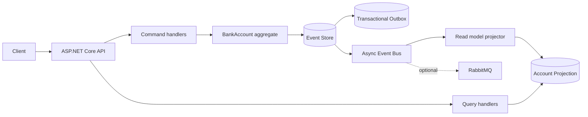

# LedgerForge

> An opinionated .NET 8 reference architecture for financial transaction workflows built with CQRS, Event Sourcing, optimistic concurrency, and asynchronous domain events.

LedgerForge is intentionally small enough to understand in one sitting and strict enough to demonstrate the engineering decisions expected in a production-grade financial system. The example domain is a bank account, but the same seams apply to orders, payments, inventory reservations, and other workflows where auditability and correctness matter more than CRUD convenience.

## Why this project exists

The source of truth is an append-only event stream. The write side rebuilds an aggregate from its history, validates domain invariants, and appends new events using an expected stream version. The read side consumes those events into a purpose-built projection.

That gives the system:

- A complete business audit trail without overwriting facts.
- Deterministic aggregate rehydration and replay.
- Explicit protection against lost updates.
- Independent evolution of command and query models.
- A clean boundary for replacing the in-memory transport with RabbitMQ.
- A transactional PostgreSQL event store and outbox schema for durable deployments.

## Architecture at a glance



### Write path

1. The API creates a command containing the caller's expected stream version.
2. The command handler loads the event history and rehydrates `BankAccount`.
3. The aggregate enforces invariants such as currency consistency, positive amounts, and sufficient funds.
4. The event store compares `expectedVersion` with the current version under a transaction.
5. The new facts are appended atomically, and the event metadata keeps correlation and causation available for tracing.
6. The bus publishes the committed envelopes.

### Read path

Queries never load or mutate the aggregate. They read from a projection optimized for the API's response shape. The default local bus projects synchronously after yielding to an asynchronous boundary; the RabbitMQ adapter is available for a separately operated consumer topology.

## Project map

```text
src/
  LedgerForge.Domain/
    Aggregates/         Business state, commands' invariants, event application
    Events/             Domain events and event envelopes
    Primitives/         Domain errors and result primitives
  LedgerForge.Application/
    Abstractions/       CQRS, event store, bus, read model ports
    Commands/           Write-side contracts and handlers
    Queries/            Read-side contracts and handlers
    Contracts/          Transport-independent API models
  LedgerForge.Infrastructure/
    EventStore/         In-memory and PostgreSQL implementations
    Messaging/          In-memory and RabbitMQ implementations
    ReadModel/          In-memory and PostgreSQL projections
    Clock/              Time abstraction
  LedgerForge.Api/
    Middleware/         Structured request logging and problem responses
    Program.cs          HTTP composition root and endpoint mapping
ops/
  postgres/init/        Idempotent PostgreSQL schema for events, outbox, and projection
tests/
  LedgerForge.Tests/    Domain and command-pipeline tests
```

## Patterns and decisions

### CQRS as a dependency boundary

Commands and queries are separate application contracts and handlers. Command handlers depend on `IEventStore` and `IEventBus`; query handlers depend on `IReadModel`. This is intentionally stricter than a single service class with `Create` and `Get` methods: the dependency graph communicates which side of the system a use case belongs to.

### Event Sourcing with an aggregate as the invariant boundary

The aggregate is not an anemic persistence model. It owns transitions and rejects invalid state changes before persistence. Rehydration only applies trusted historical events and never creates new uncommitted facts.

### Optimistic concurrency

Every mutation requires `expectedVersion`. PostgreSQL serializes writers per stream with a transaction-scoped advisory lock and verifies the version before inserting. The composite `(stream_id, version)` primary key is a second line of defense. A mismatch returns HTTP `409 Conflict`, allowing a caller to reload and retry deliberately.

### Transactional outbox

The PostgreSQL schema persists the event and an outbox record in the same transaction. This is the durability seam for a production publisher: events are not acknowledged as committed unless the business fact and its delivery intent are both stored. The local profile uses an in-process bus to keep onboarding friction low.

### Structured observability

The API emits JSON logs with correlation id, trace id, method, route, status code, elapsed time, and exception details. Clients can supply `X-Correlation-Id`; otherwise ASP.NET's request trace id is used. Error responses expose a stable problem code while avoiding internal exception details for unexpected failures.

### Explicit infrastructure choices

There are no hidden service locators or static repositories. The composition root selects providers through configuration:

| Concern | Local default | Durable option |
| --- | --- | --- |
| Event store | `InMemoryEventStore` | `PostgresEventStore` |
| Read model | `InMemoryReadModel` | `PostgresReadModel` |
| Event bus | `InMemoryEventBus` | `RabbitMqEventBus` |

## Run locally

### Requirements

- .NET SDK 8
- Docker and Docker Compose (only required for PostgreSQL/RabbitMQ mode)

### Fast path: no external services

```bash
dotnet restore LedgerForge.sln
dotnet run --project src/LedgerForge.Api
```

The API starts with in-memory persistence and transport. Swagger is available at `http://localhost:5000/swagger` when using the standard development profile.

### Full infrastructure profile

Start the supporting services:

```bash
docker compose up -d
```

Run the API using the production provider selection:

```bash
ASPNETCORE_ENVIRONMENT=Production \
ConnectionStrings__LedgerForge='Host=localhost;Port=5432;Database=ledgerforge;Username=ledgerforge;Password=ledgerforge' \
dotnet run --project src/LedgerForge.Api
```

The production configuration selects PostgreSQL and RabbitMQ. The schema is mounted into PostgreSQL's initialization directory and is safe to re-run in a fresh volume.

> The RabbitMQ adapter is a transport boundary, not a claim that one process should own the entire distributed topology. In a real deployment, run the outbox publisher and projection consumers as independently scaled workers, with retry, dead-lettering, idempotency, and operational dashboards.

## API walkthrough

Create an account. `expectedVersion: 0` means the stream must not exist yet:

```bash
ACCOUNT_ID=$(uuidgen)

curl -i -X POST "http://localhost:5000/api/accounts/$ACCOUNT_ID" \
  -H 'Content-Type: application/json' \
  -H 'X-Correlation-Id: portfolio-demo-open' \
  -d '{"ownerId":"portfolio-user","currency":"BRL","expectedVersion":0}'
```

Fund it using the version returned by the previous command:

```bash
curl -i -X POST "http://localhost:5000/api/accounts/$ACCOUNT_ID/deposits" \
  -H 'Content-Type: application/json' \
  -d '{"amount":250.00,"currency":"BRL","reference":"initial-funding","expectedVersion":1}'
```

Read the projection and the immutable history:

```bash
curl "http://localhost:5000/api/accounts/$ACCOUNT_ID"
curl "http://localhost:5000/api/accounts/$ACCOUNT_ID/events"
```

Try the same mutation twice with `expectedVersion: 1`. The second attempt returns `409 Conflict`, demonstrating lost-update protection.

## Quality gates

```bash
dotnet build LedgerForge.sln
dotnet test LedgerForge.sln
```

The CI workflow runs restore, release build, and the complete test suite on pushes and pull requests to `main`.

## Production hardening checklist

This repository focuses on architectural clarity, not pretending a sample is a complete regulated platform. Before production use, add:

- Outbox publisher with leasing, retry backoff, idempotency keys, and dead-letter queues.
- Consumer-side checkpoints and projection rebuild tooling.
- Authentication, authorization, rate limiting, and tenant isolation.
- Database encryption, secret management, retention policies, and audit access controls.
- OpenTelemetry traces/metrics, SLOs, alerting, and structured PII redaction.
- Contract tests for message schemas and compatibility rules for event evolution.
- Reconciliation jobs and operational tooling for payment provider callbacks.

## License

MIT — use it as a reference, extend it, and make your own trade-offs explicit.