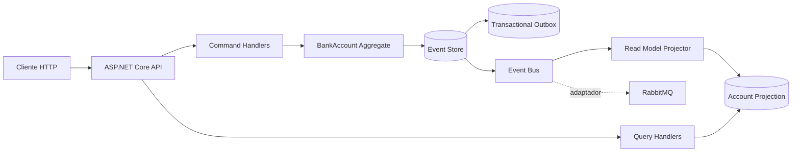

<div align="center">

# LedgerForge

### Arquitetura de referência para fluxos financeiros com .NET 8

[](https://dotnet.microsoft.com/)
[](https://learn.microsoft.com/dotnet/csharp/)
[](https://www.postgresql.org/)
[](https://www.rabbitmq.com/)

**CQRS · Event Sourcing · Concorrência otimista · Transactional Outbox · Testes automatizados**

[Como executar](#como-executar) · [Arquitetura](#arquitetura) · [Demonstração](#demonstração-da-api) · [Decisões técnicas](#decisões-técnicas)

</div>

---

## Visão geral

O **LedgerForge** é uma API backend que simula o fluxo de contas bancárias usando uma arquitetura orientada a eventos. O projeto foi criado para demonstrar como construir um sistema auditável e consistente quando a integridade das informações é mais importante do que a simplicidade de um CRUD.

Em vez de sobrescrever o saldo atual, o sistema registra fatos imutáveis — como conta criada, depósito e saque — e reconstrói o estado a partir do histórico de eventos.

> **O que este projeto demonstra:** domínio rico, separação entre comandos e consultas, proteção contra atualizações perdidas, persistência transacional, mensageria assíncrona e observabilidade estruturada.

## Principais recursos

- Criação de contas e operações de depósito e saque.
- **Event Sourcing** com stream de eventos imutável.
- **CQRS** separando o fluxo de escrita do modelo de leitura.
- **Concorrência otimista** com retorno `409 Conflict` em versões conflitantes.
- Projeção de leitura independente do agregado de domínio.
- Event store e read model em memória para onboarding rápido.
- Implementações duráveis com PostgreSQL.
- Event bus local e adaptador RabbitMQ.
- Transactional Outbox para manter evento e intenção de publicação na mesma transação.
- Logs JSON com correlation ID, trace ID, rota, status e tempo de resposta.
- Testes de domínio e do pipeline de comandos.
- Swagger/OpenAPI para explorar os endpoints.

## Arquitetura



### Fluxo de escrita

1. A API recebe um comando com o `expectedVersion` do stream.
2. O handler carrega o histórico e reidrata o agregado `BankAccount`.
3. O agregado valida as regras de negócio, como moeda, valor positivo e saldo suficiente.
4. O event store verifica a versão dentro de uma transação.
5. O novo evento é persistido atomicamente com sua intenção de publicação.
6. O event bus encaminha o fato para atualizar o modelo de leitura.

### Fluxo de leitura

As consultas não carregam nem alteram o agregado. Elas leem uma projeção criada especificamente para o formato de resposta da API. Esse isolamento permite evoluir o modelo de leitura sem comprometer as regras do domínio.

## Organização do código

```text
src/
├── LedgerForge.Domain/          # Agregados, eventos e regras de negócio
├── LedgerForge.Application/     # Commands, queries e contratos
├── LedgerForge.Infrastructure/  # PostgreSQL, RabbitMQ, projeções e clock
└── LedgerForge.Api/             # Endpoints, middleware e composição

ops/postgres/init/               # Schema de eventos, outbox e projeções
tests/LedgerForge.Tests/         # Testes de domínio e pipeline
```

## Decisões técnicas

| Problema | Decisão | Benefício |
|---|---|---|
| Auditoria de alterações | Event Sourcing | Histórico completo e reprodutível |
| Separação de leitura e escrita | CQRS | Contratos e responsabilidades mais claros |
| Atualizações simultâneas | Concorrência otimista | Evita sobrescrever alterações concorrentes |
| Entrega de eventos | Transactional Outbox | Persiste fato e intenção de publicação juntos |
| Evolução da infraestrutura | Ports and adapters | Permite trocar implementações sem alterar o domínio |
| Diagnóstico de requisições | Logs estruturados | Facilita rastreamento e investigação de falhas |

## Como executar

### Pré-requisitos

- [.NET SDK 8](https://dotnet.microsoft.com/download/dotnet/8.0)
- Docker e Docker Compose apenas para o perfil com PostgreSQL e RabbitMQ

### Execução rápida — sem serviços externos

```bash
dotnet restore LedgerForge.sln
dotnet run --project src/LedgerForge.Api
```

A API inicia com persistência e transporte em memória. A documentação Swagger fica disponível em:

**http://localhost:5000/swagger**

### Perfil completo — PostgreSQL e RabbitMQ

```bash
docker compose up -d

ASPNETCORE_ENVIRONMENT=Production \
ConnectionStrings__LedgerForge='Host=localhost;Port=5432;Database=ledgerforge;Username=ledgerforge;Password=ledgerforge' \
dotnet run --project src/LedgerForge.Api
```

## Demonstração da API

Crie uma conta. O valor `expectedVersion: 0` indica que o stream ainda não existe:

```bash
ACCOUNT_ID=$(uuidgen)

curl -i -X POST "http://localhost:5000/api/accounts/$ACCOUNT_ID" \
  -H 'Content-Type: application/json' \
  -H 'X-Correlation-Id: portfolio-demo-open' \
  -d '{"ownerId":"portfolio-user","currency":"BRL","expectedVersion":0}'
```

Faça um depósito usando a versão retornada pela criação:

```bash
curl -i -X POST "http://localhost:5000/api/accounts/$ACCOUNT_ID/deposits" \
  -H 'Content-Type: application/json' \
  -d '{"amount":250.00,"currency":"BRL","reference":"initial-funding","expectedVersion":1}'
```

Consulte o saldo projetado e o histórico imutável:

```bash
curl "http://localhost:5000/api/accounts/$ACCOUNT_ID"
curl "http://localhost:5000/api/accounts/$ACCOUNT_ID/events"
```

Ao repetir uma operação com uma versão antiga, a API retorna `409 Conflict`, demonstrando a proteção contra **lost updates**.

## Qualidade e testes

```bash
dotnet build LedgerForge.sln
dotnet test LedgerForge.sln
```

O projeto inclui testes para regras do agregado e para o pipeline de comandos. Também há uma definição de CI portátil em [`docs/github-actions-ci.yml`](docs/github-actions-ci.yml).

## Limites conscientes do exemplo

O LedgerForge prioriza clareza arquitetural e não pretende ser uma plataforma financeira pronta para produção. Para um ambiente real, ainda seriam necessários autenticação, autorização, isolamento de tenants, gestão de segredos, idempotência, retries, dead-letter queues, OpenTelemetry, políticas de retenção, reconciliação e controles específicos de compliance.

Essa explicitação de limites faz parte do projeto: uma arquitetura de referência deve deixar claro o que resolve e quais decisões ainda dependem do contexto operacional.

## Licença

MIT — use como referência, estenda o projeto e torne suas decisões técnicas explícitas.

<div align="center">

**Projeto de portfólio por [Ryan Henri Martins](https://github.com/dev-ryanmartins)**

</div>
